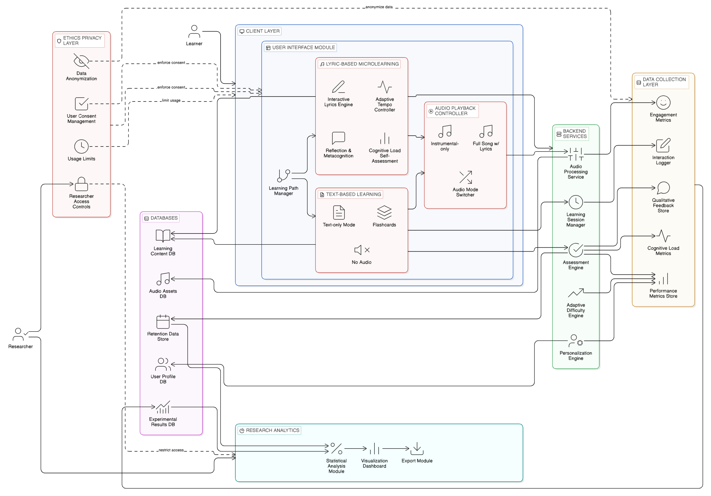

# Lingofy 🎵📚

> **A music-integrated language learning platform** — an HCI research prototype exploring how music-driven interaction, personalization, and engagement influence language learning outcomes.


---

## 📑 Table of Contents

- [Live Demo](#-live-demo)
- [What is Lingofy?](#-what-is-lingofy)
- [Screenshots](#-screenshots)
- [Core Features](#-core-features)
- [Tech Stack](#-tech-stack)
- [Project Structure](#-project-structure)
- [Architecture Overview](#-architecture-overview)
- [System Architecture](#-system-architecture)
- [Quick Start](#-quick-start)
- [Documentation Index](#-documentation-index)
- [HCI Research Context](#-hci-research-context)
- [Contributing](#-contributing)
- [Author](#-author)
- [License](#-license)

---

## 🌐 Live Demo

Experience the live application here: **[Lingofy Live Demo](https://lingofy-seven.vercel.app/)**

---

## 🎯 What is Lingofy?

Lingofy is a full-stack web application built as part of an **HCI (Human-Computer Interaction) academic research study**. It teaches users languages (Hindi, Spanish, Korean) through **music-driven immersion**: song playback with synchronized lyrics, vocabulary quizzes generated from those lyrics via AI, and structured learning roadmaps. 

Designed primarily for educational researchers, linguists, and students, the platform serves as a vital tool for conducting empirical studies on language acquisition. The motivation behind this project is to bridge the gap between passive music listening and active language learning, transforming a universal hobby into a structured educational methodology.

The application compares two experimental conditions:
- **Music Mode** — learners interact with songs, synchronized lyrics, and AI quizzes derived from lyric content
- **Traditional Mode** — learners use standard text-based AI-generated vocabulary quizzes

This allows researchers to measure whether music-based context improves engagement, retention, and learning outcomes compared to traditional methods.

---

## ✨ Core Features

| Feature | Description |
|---|---|
| 🎵 **Music Player** | YouTube-embedded player with synchronized scrolling lyrics and translations |
| 🤖 **AI Lesson Generation** | Uses Groq (LLaMA 3.3 70B) to dynamically generate 10-question quizzes per session |
| 🗺️ **Learning Roadmap** | Structured Easy → Intermediate → Hard progression with badge/XP unlock system |
| 🎙️ **Pronunciation Mode** | Web Speech API integration with Levenshtein-distance accuracy scoring (0–100%) |
| 🎯 **Focus Area Practice** | Targeted sessions: Vocabulary, Listening, Grammar, or Culture/Idioms |
| 🏅 **Achievements Hub** | Badges unlock dynamically (Easy Explorer, Intermediate Scholar, Language Star, etc.) |
| 🔔 **In-App Notifications** | Badge unlock alerts, admin broadcasts, with email delivery via Nodemailer |
| 📋 **Custom Playlists** | Users create, manage, and queue song playlists |
| 📊 **Learning Analytics** | Score trends, activity heatmaps, XP tracking, per-attempt drill-down |
| 🔬 **Admin Dashboard** | Song/lyric management, user stats, HCI comparison analytics (Music vs Traditional) |
| 👤 **Comprehensive Profiles** | Daily goals, native/target language, profession, proficiency level |
| 🔑 **Auth** | Email/password + Google OAuth, JWT sessions, forgot-password via 6-digit email code |

---

## 🛠 Tech Stack

### Frontend
| Package | Version | Purpose |
|---|---|---|
| React | 19.x | UI framework |
| TypeScript | 5.9.x | Type safety |
| Vite | 7.x | Build tool / dev server |
| React Router DOM | 7.x | Client-side routing |
| Framer Motion | 12.x | Animations and transitions |
| Lucide React | 0.577.x | Icon library |
| @react-oauth/google | 0.13.x | Google OAuth button |
| Recharts | 3.x | Data visualisation |
| Axios | 1.x | HTTP client |

### Backend
| Package | Version | Purpose |
|---|---|---|
| Express | 5.x | HTTP server framework |
| TypeScript + ts-node | 5.9.x / 10.9.x | Typed Node.js runtime |
| Mongoose | 9.x | MongoDB ODM |
| JSON Web Token | 9.x | Stateless auth sessions |
| bcryptjs | 3.x | Password hashing |
| Groq SDK | 1.x | LLaMA AI lesson generation |
| google-auth-library | 10.x | Google ID-token verification |
| Nodemailer | 9.x | Password reset & notification emails |
| youtube-transcript | 1.3.x | Fetch captions from YouTube videos |
| Axios | 1.x | Server-side HTTP (Google Translate API) |
| Helmet | 7.x | HTTP security headers |
| Morgan | 1.x | Request logging |
| CORS | 2.x | Cross-origin resource sharing |
| dotenv | 17.x | Environment variable loading |

---

## 📁 Project Structure

```
lingofy/
├── frontend/                    # React + TypeScript + Vite SPA
│   ├── src/
│   │   ├── App.tsx              # Root router (6 routes)
│   │   ├── main.tsx             # React entry point
│   │   ├── pages/
│   │   │   ├── LandingPage.tsx  # Public landing
│   │   │   ├── LoginPage.tsx    # Login (email + Google OAuth)
│   │   │   ├── SignupPage.tsx   # Registration
│   │   │   ├── PreferencesPage.tsx  # Onboarding: language & genre prefs
│   │   │   ├── DashboardPage.tsx    # Main app (music, stats, profile, achievements)
│   │   │   ├── LessonsPage.tsx      # Roadmap, quiz engine, pronunciation
│   │   │   └── AdminDashboard.tsx   # Admin-only: songs, users, analytics
│   │   ├── components/
│   │   │   ├── common/          # AudioToggle, Button, ProgressBar
│   │   │   └── learning/        # Flashcard, InteractiveLyrics, LyricsLearning,
│   │   │                        # PronunciationSettingsModal, TextLearning
│   │   ├── services/
│   │   │   ├── api.ts           # (stub — API calls are inline in pages)
│   │   │   └── analytics.ts     # (stub — analytics helpers)
│   │   ├── types/               # TypeScript type definitions
│   │   └── utils/               # Utility functions
│   ├── index.html
│   ├── vite.config.ts
│   └── package.json
│
├── backend/                     # Node.js + Express + TypeScript API
│   ├── src/
│   │   ├── server.ts            # Entrypoint: connects DB, starts listen
│   │   ├── app.ts               # Express app setup, middleware, route mounting
│   │   ├── config/
│   │   │   ├── db.ts            # Mongoose connect helper
│   │   │   └── env.ts           # Typed env variable access
│   │   ├── middleware/
│   │   │   ├── authMiddleware.ts # JWT protect() + admin() guards
│   │   │   ├── roleMiddleware.ts # adminOnly() guard
│   │   │   ├── errorHandler.ts  # Global error handler
│   │   │   └── requestLogger.ts # Request logging
│   │   ├── routes/
│   │   │   ├── authRoutes.ts    # /api/auth/*
│   │   │   ├── userRoutes.ts    # /api/users/*
│   │   │   ├── preferenceRoutes.ts  # /api/preferences/*
│   │   │   ├── songRoutes.ts    # /api/admin/* (songs + user mgmt)
│   │   │   ├── lessons.ts       # /api/lessons/*
│   │   │   ├── playlistRoutes.ts    # /api/playlists/*
│   │   │   ├── notificationRoutes.ts # /api/notifications/*
│   │   │   └── analyticsRoutes.ts   # /api/admin/analytics/*
│   │   ├── controllers/
│   │   │   ├── authController.ts       # register, login, google, forgot/reset
│   │   │   ├── notificationController.ts
│   │   │   ├── user/
│   │   │   │   ├── userController.ts   # getMe, updateProfile, changeMode
│   │   │   │   └── preferenceController.ts
│   │   │   ├── music/
│   │   │   │   └── songController.ts   # addSong, getSongs, autoTranslate, getSegments
│   │   │   └── analytics/
│   │   │       └── analyticsController.ts
│   │   ├── models/
│   │   │   ├── LessonAttempt.ts
│   │   │   ├── user/
│   │   │   │   ├── User.ts
│   │   │   │   ├── UserPreference.ts
│   │   │   │   ├── Notification.ts
│   │   │   │   └── ExperminentAssignment.ts
│   │   │   ├── music/
│   │   │   │   ├── Song.ts
│   │   │   │   ├── LyricSegment.ts
│   │   │   │   ├── Artist.ts
│   │   │   │   ├── Album.ts
│   │   │   │   └── Vocabulary.ts
│   │   │   ├── playlist/
│   │   │   │   ├── Playlist.ts
│   │   │   │   └── PlaylistSong.ts
│   │   │   └── learning/
│   │   │       ├── LearningSession.ts
│   │   │       ├── AdaptiveTempo.ts
│   │   │       ├── ErrorTracking.ts
│   │   │       └── SegmentInteraction.ts
│   │   ├── services/
│   │   │   ├── lessonService.ts    # AI quiz generation (standard + song lessons)
│   │   │   └── focusAreaService.ts # AI focus-area quiz generation
│   │   ├── scripts/
│   │   │   └── seedAdmin.ts        # Seed initial admin user
│   │   ├── constants/
│   │   ├── types/
│   │   ├── utils/
│   │   └── validators/
│   └── package.json
│
├── docs/                        # Research documentation
├── system-archietecture/        # Architecture diagrams
└── README.md
```

---

## 🏗️ Architecture Overview

```
┌─────────────────────────────────────────────────────────┐
│                    USER BROWSER                         │
│   React SPA (Vite) — localhost:5173                     │
│   ┌──────────┐  ┌───────────┐  ┌──────────────────┐    │
│   │ Auth     │  │ Dashboard │  │  LessonsPage     │    │
│   │ Pages    │  │ (Music +  │  │  (Roadmap +      │    │
│   │          │  │  Stats +  │  │   Quiz Engine)   │    │
│   │          │  │  Profile) │  │                  │    │
│   └──────────┘  └───────────┘  └──────────────────┘    │
│        │              │                  │              │
│        └──────────────┼──────────────────┘              │
│           fetch() + Bearer JWT                          │
└───────────────────────┼─────────────────────────────────┘
                        │ HTTP / REST
┌───────────────────────┼─────────────────────────────────┐
│               EXPRESS API — localhost:5000               │
│                        │                                │
│  ┌─────────────────────▼──────────────────────────┐    │
│  │              Middleware Chain                   │    │
│  │  cors() → express.json() → protect() (JWT)     │    │
│  └────────────────────────────────────────────────┘    │
│         │           │            │           │          │
│   /api/auth   /api/users   /api/lessons  /api/admin     │
│         │           │            │           │          │
│  ┌──────▼───────────▼────────────▼───────────▼──────┐  │
│  │              Controllers / Services               │  │
│  │  authController  userController  lessonService   │  │
│  │  songController  analyticsController  ...        │  │
│  └───────────────────────┬───────────────────────────┘  │
│                          │ Mongoose ODM                  │
└──────────────────────────┼──────────────────────────────┘
                           │
┌──────────────────────────┼──────────────────────────────┐
│              MongoDB Atlas (lingofy DB)                  │
│  users  userpreferences  songs  lyricsegments           │
│  lessonattempts  playlists  playlistsongs               │
│  notifications  experimentassignments  ...              │
└─────────────────────────────────────────────────────────┘
                           │
               ┌───────────┼────────────┐
               ▼           ▼            ▼
          Groq API    Google OAuth  Nodemailer
       (LLaMA 3.3)   (ID Token     (Gmail SMTP)
                      Verify)
```

---

## 🏗️ System Architecture




## ▶️ Quick Start

See **[SETUP.md](./SETUP.md)** for full step-by-step instructions.

```bash
# Backend
cd backend && npm install && npm run dev

# Frontend (new terminal)
cd frontend && npm install && npm run dev
```

| Service | URL |
|---|---|
| Frontend | http://localhost:5173 |
| Backend API | http://localhost:5000 |
| Health check | http://localhost:5000/health |

---

## 📚 Documentation Index

| Document | Contents |
|---|---|
| [README.md](./README.md) | This file — overview, features, quick start |
| [SETUP.md](./SETUP.md) | Prerequisites, environment variables, step-by-step setup |
| [ARCHITECTURE.md](./ARCHITECTURE.md) | Folder structure, request flow, key modules explained |
| [API.md](./API.md) | Every API route: method, path, auth, body, response |

---

## 🔬 HCI Research Context

This application implements a **between-subjects experiment**:

- **Group A (Music Mode)** — learners hear songs, see synchronized lyrics, and take AI quizzes generated from those lyrics
- **Group B (Traditional Mode)** — learners take standard text vocabulary quizzes without music context

The `ExperimentAssignment` model tracks group assignments. The analytics dashboard compares avg. score, accuracy %, XP earned, dropout rate, and time-per-question between the two groups.

---

## ✍️ Author

**Unnati Jadon**  
Full-Stack Developer & AI/ML Enthusiast 

---

## 📄 License

This project is developed for academic / HCI research purposes only. Not intended for commercial distribution.
